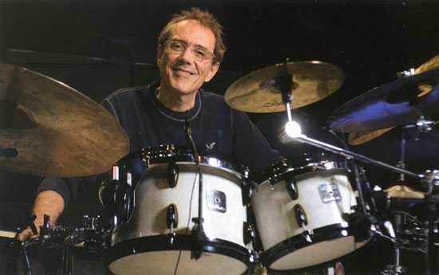

<div align="center">

</div>

**VC Radio** is a custom-built music web application created as a tribute to one of the greatest drummers of all time — Vinnie Colaiuta.
It allows users to generate a random album from Colaiuta’s vast discography (over 2,700 albums!) and listen to music directly within the app via an integrated audio player.
<div align="center">

</div>

---

## Project Goals

The main goal of **VC Radio** was to serve as a learning environment for mastering backend development with Django. From designing the architecture to deployment and containerization – this project reflects my self-taught journey and growth as a developer.

---

## Features

- **Album generator** – randomly pick an album from Vinnie’s extensive career.
- **Discography scraping** – includes a custom-built scraper to keep album data updated.
- **YouTube-powered audio player** – search and stream Vinnie’s tracks directly from YouTube via a custom JS player.
- **Dynamic frontend** – interactive single-page experience built with Flask templates and JavaScript.
- **Modular codebase** – utilities and views separated for clarity and maintainability.
- **Testing suite** – includes unit and integration tests.

---

## Tech Stack

- **Backend:** Python 3.x, Flask
- **Frontend:** HTML/CSS, JavaScript
- **Web scraping:** `requests`, `BeautifulSoup`
- **DevOps:** Docker, Docker Compose, Nginx, Let's Encrypt (SSL)
- **Testing:** `pytest`
- **Hosting:** DigitalOcean VPS (Ubuntu)

---

## Setup / Running Locally

#### Prerequisites:

- Docker & Docker Compose
- Git

### 1. Clone the repository

```sh
git clone https://github.com/MariuszLepkowski/VC-Radio.git
cd VC-Radio
```

### 2. Set up environment variables

Copy the example environment file and fill in your own keys:
```sh
cp .env.example .env
```
ouTube API Key Required

**DISCLAIMER**: VC Radio uses the **YouTube Data API v3** to search for and stream music content.
To enable this functionality, you must provide your own YouTube API key.

You can obtain an API key by:

    1. Going to Google Cloud Console.

    2. Creating a new project or selecting an existing one.

    3. Enabling the YouTube Data API v3.

    4. Creating an API key from the Credentials section.

Once you have your key, place it inside your .env file as follows:

    YT_API_KEY='your-api-key-here'

**Note**: Without a valid API key, album search and playback functionality will not work.


### 3. Build and run the app

```sh
docker compose -f docker-compose.dev.yml up --build
```

The app will be available at: http://localhost:5000

---
## Project Structure

```
VC-Radio/
├── VC_Radio_app/                  # Main Flask app
│   ├── static/                    # JS, CSS, Images
│   ├── templates/                 # HTML templates
│   ├── utils/                     # Python utility modules (audio player, YouTube, album search)
│   └── views/                     # Route and view logic
│
├── VC_discography_scraper/       # Discography scraper script
│   └── discography_downloader.py
│
├── tests/                         # Unit and integration tests
│
├── main.py                        # Entry point
├── requirements.txt               # Dependencies
├── Dockerfile                     # Docker image for dev
├── docker-compose.dev.yml         # Compose for dev setup
└── README.md                      # Project documentation
```

---
## Testing

Tests are written using **pytest**.

---
## Deployment & Hosting

The application is deployed on a **DigitalOcean VPS** using:

- **Docker** for containerization
- **Nginx** as a reverse proxy and SSL termination (Let's Encrypt certificates)
- **Gunicorn** as the WSGI HTTP server

---

## License / Disclaimer

**Disclaimer:** The project has been created as a non-commercial programming portfolio project for educational and recruitment purposes only.

**All album and video content is embedded from public sources (YouTube).**

This project is not affiliated with or endorsed by Vinnie Colaiuta or any record label.
All rights reserved. 

Not licensed for commercial use.

---

## Live Demo & Repository

- **Live App:** [https://vcradio.duckdns.org/](https://drumlib.duckdns.org/)
- **Source Code:** [https://github.com/MariuszLepkowski/VC-Radio](https://github.com/MariuszLepkowski/DrumLib)

---